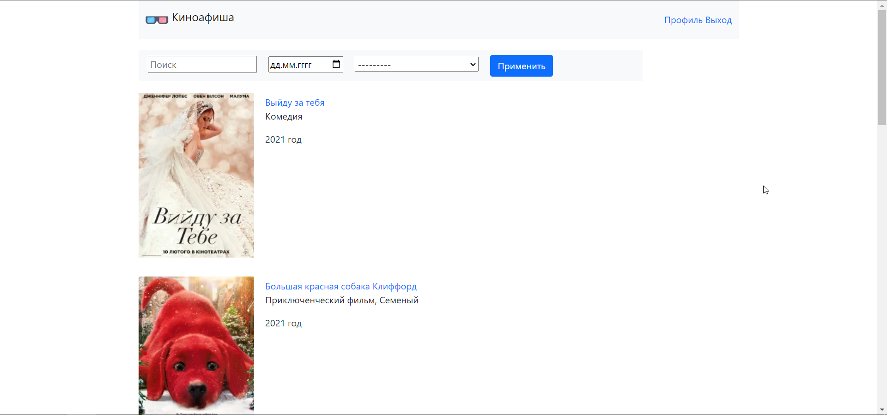
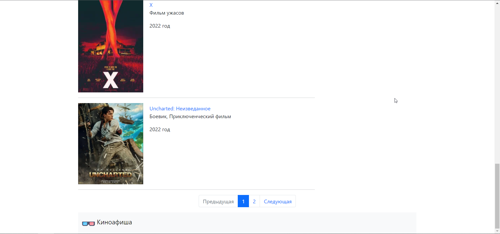
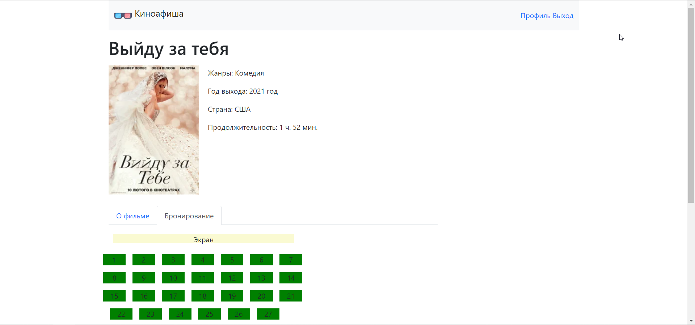
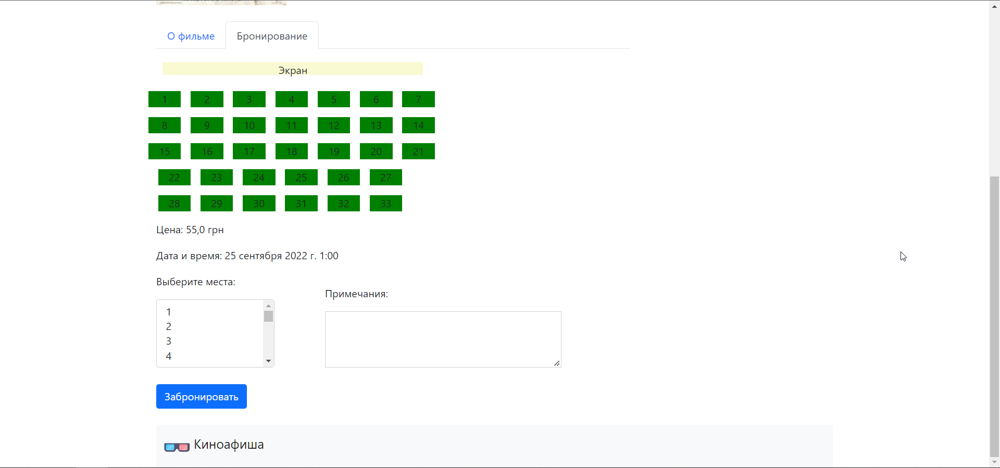
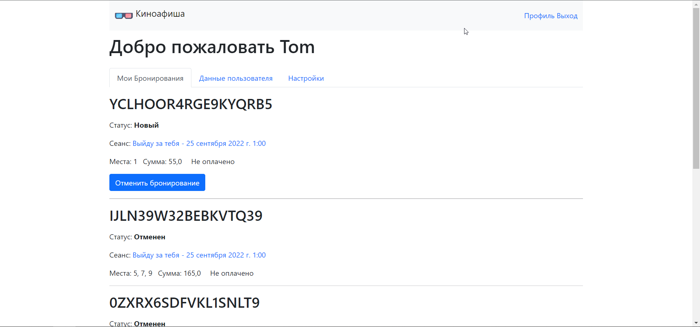
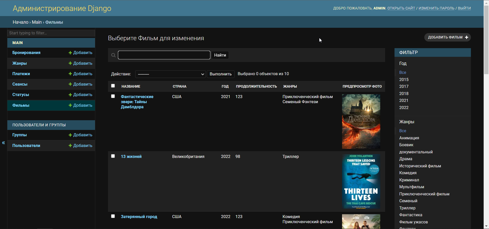
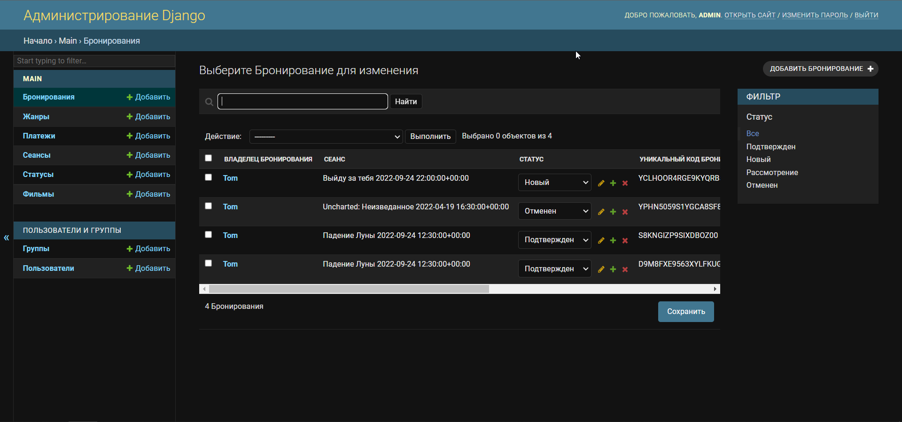

# tcp_course_project
___
**Theme**: Information system "Cinema" (ticket booking)\
**Main business process**: The client places an order for booking
a certain number of tickets to selected places. 
The administrator confirms the reservation after 
which the client in his profile can see a unique code 
by which he can buy tickets at the box office or 
online in his profile, no later than the time before 
the session.

**Functions of all users:**
* See movie sessions
* View free seats

**Functions of client:**
* Booking tickets
* Pay for tickets
* Cancel booking

**Functions of administrator (moderator):**
* View bookings
* Change status of bookings
* Add movie sessions

## Technologies Used:
* Python 3.10
* Django 4.0.1
* Bootstrap 5
* MySQL 8

## Screenshots:
### Home

### Session detail

### Profile

### Admin panel

